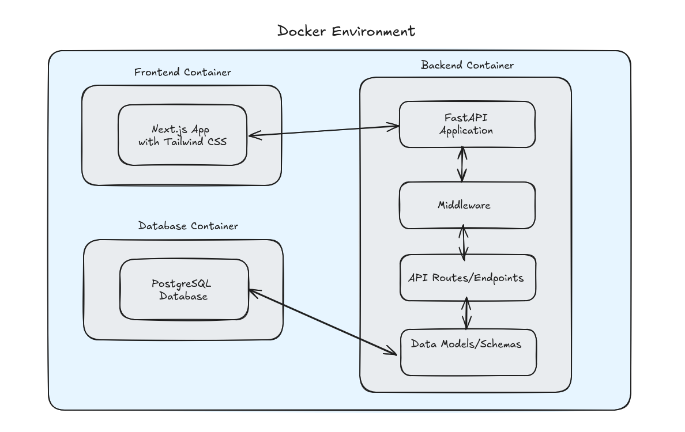

# Blog Post Manager

## Description

This project is a full stack blog post manager that allows users to add, view, update, and delete blog posts ensuring a smooth and interactive user experience while following best practices in both frontend and
backend development.

## Architecture



## Run

### Development

Run the following command to start the development environment and access the application at [http://localhost:3000](http://localhost:3000).

```bash
docker-compose up -d --build
```
